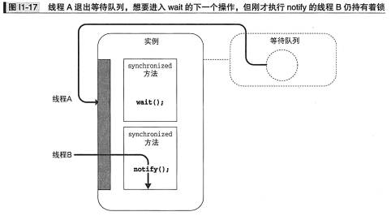
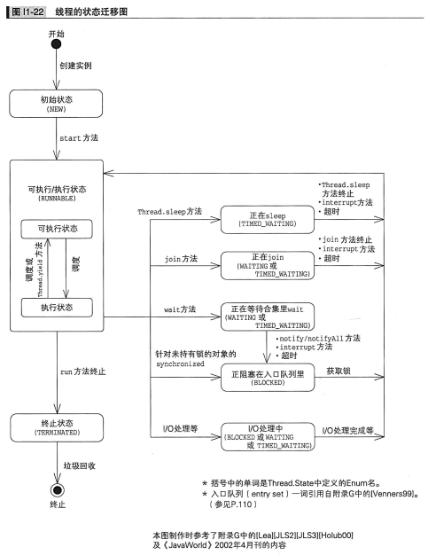

此仓库包含了[图解Java多线程设计模式](https://www.amazon.com/%E5%9B%BE%E8%A7%A3Java%E5%A4%9A%E7%BA%BF%E7%A8%8B%E8%AE%BE%E8%AE%A1%E6%A8%A1%E5%BC%8F-%E7%BB%93%E5%9F%8E%E6%B5%A9/dp/B01N7EVWOH) 的代码和笔记

# Intro 01. Java Thread

## 线程的启动

1. 继承Thread类 [PrintThread](./src/chapter_00_intro1_java_thread/demo02/PrintThread.java)
2. 实现runnable接口 [PrintRunnable](./src/chapter_00_intro1_java_thread/demo02/PrintRunnable.java)
3. ThreadFactory，将runnable传入newThread方法中 [PrintThreadFactory](./src/chapter_00_intro1_java_thread/demo02/PrintThreadFactory.java)
   Thread类本身就是实现了Runnable接口，其run方法为空

## 线程的暂停

```java
Thread.sleep(1000);
```

## 线程的互斥

* synchronized方法
* synchronized代码块
  * vs synchronized实例方法：两者等效，也就是说`synchronized实例方法`是通过使用`this`锁来实现互斥的
    ```java
        synchronized void method1() {
        }
        void method1() {
            synchronized(this) {
            }
        }

    ```
  * vs synchronized静态方法：静态方法每次只能由一个线程运行，但是静态方法和实例方法使用的锁是不一样的，`synchronized静态方法`是通过使用`类对象`锁，即`SomeClass`类对应的`java.lang.class` 的实例，来实现互斥的
    ```java
        class SomeClass {
            synchronized static void method1() {
            }
            static void method1() {
                synchronized(SomeClass.class) {
                }
            }
        }

    ```

## 线程的协作

* wait()方法
* notify()方法
  * notify唤醒的线程不会立即开始运行，因为执行notify的线程还持有着锁
    
* notifyAll()方法

该三个方法都是Object类的方法，与其说是对线程的操作不如说是针对实例的等待队列的操作

## 线程的状态迁移

Thread.Stat(Enum)，可以通过getState()方法获取

* NEW
* RUNNABLE
* TERMINATED
* WAITING
* TIMED_WAITING
* BLOCKED



# Intro 02. 多线程程序的评价指标

* 安全性 safety----不损坏对象
* 生存性 liveness----必要的处理能够被执行（不死锁）
* 可重复性 reusability----类可重复利用
* 性能 performance----能快速、大批量的执行

# 第一章 Single Thread Execution 模式：只能有一个人通过这个桥

## 不使用 Single Threaded Execution模式

[Demo 1](./src/chapter_01_SingleThreadedExecution/demo1/Main.java)的输出结果

```bash
*************** Broken *************** Gate{counter=-1682490252, name='Chris', address='Alaska'}
*************** Broken *************** Gate{counter=-1682488874, name='Chris', address='Canada'}
*************** Broken *************** Gate{counter=-1682487562, name='Chris', address='Alaska'}
*************** Broken *************** Gate{counter=-1682491976, name='Chris', address='Canada'}
```

由此可见：**测试也无法证明安全性**，调试信息也不可靠。
通常情况下 线程不会考虑其他线程的操作，而是自己一直跑下去，当同时有两个线程要修改name字段，竞争中获胜的一方会先写入值，既data race。此时各字段的值都无法预测。

## 使用 Single Threaded Execution模式

加入 synchronized 关键词

### Single Threaded Execution模式中的角色

* SharedResource：可以被多个线程访问的累，包含很多方法，包括：
  * safeMethod：多个线程同时调用也不会发生问题的方法
  * unsafeMethod：多个线程同时调用会发生问题，因此必须加以保护的方法
    * Java中Single Threaded Execution模式使用**synchronized**进行保护
  * 我们把只允许单个线程执行的程序范围成为**临界区**

### 何时使用

* 多线程时
* 多线程同时访问时
* 状态有可能发生变化时
* 需要确保安全性时

### 生存性与死锁

Single Threaded Execution模式存在发生死锁的危险，满足下列条件时，死锁就会发生：

* 存在多个SharedResource角色
* 线程在持有某个SharedResource角色的锁的同时还想获取其他SharedResource的锁
* 获取SharedResource角色的锁的顺序不固定

只需要破坏1，2，3中的一个条件，就可以防止死锁发生

### 可复用性和继承反常（inheritance anomaly）

假设我们需要编写一个SharedResource角色的子类， 如果子类能够访问SharedResource角色的字段，那么developer就可能会不小心写出无保护的unsafeMethod.
如果不讲包含子类在内的所有unsafeMethod都申明为synchronized方法，就无法确保SharedResource角色的安全性

### 临界区的大小和性能

一般情况下Single Threaded Execution模式会降低程序性能：

* 获取锁花费时间
* 线程冲突引起的等待：如果尽可能的缩小临界区的范围，降低线程冲突的概率，那么就能够抑制性能的下降

## 想问的设计模式

* Immutable 模式
* Guarded Suspension 模式
* Read-Write Lock 模式
* Thread-Specific Storage 模式

## 衍生阅读：

### synchronized

* synchronized与Before/After模式：
  不管是synchronized方法还是synchronized代码块，都需要用"{"和"}"包起来，可以吧”{“想像成lock，“}”想像成unlock。
  但是如果换成lock/unlock，一旦代码中有return和异常那锁就不会被释放；如果使用lock那务必把unlock放在finally中确保锁被释放
* synchronized在保护什么
* 该用什么单位来保护/使用那个锁来保护
* atomic / volatile
* long与double的操作不是原子的（？？？）

### java.util.concurrent包和计数信号量

* 计数信号量和Semaphore类
  * 如果我们需要一个资源可以被“最多N个线程”执行，就需要计数信号量
  * java.util.concurrent提供Semaphore类
  * 资源的许可个数（permits），acquire/release方法用于获取/释放资源

# 第二章 Immutable 模式：想破坏也破坏不了


# 第三章 Guarded Suspension 模式

# 第四章 Balking 模式

# 第五章 Producer-Consumer 模式

# 第六章 Read-Write Lock 模式

# 第七章 Thread-Per-Message 模式

# 第八章 Worker Thread 模式

# 第九章 Future 模式

# 第十章 Two-Phase 模式

# 第十一章 Thread-Specific Storage 模式

# 第十二章 Active Object 模式
