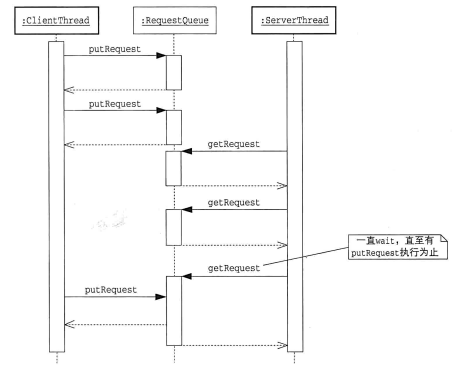

此仓库包含了[图解Java多线程设计模式](https://www.amazon.com/%E5%9B%BE%E8%A7%A3Java%E5%A4%9A%E7%BA%BF%E7%A8%8B%E8%AE%BE%E8%AE%A1%E6%A8%A1%E5%BC%8F-%E7%BB%93%E5%9F%8E%E6%B5%A9/dp/B01N7EVWOH) 的代码和笔记

# Intro 01. Java Thread

## 线程的启动

1. 继承Thread类 [PrintThread](./src/chapter_00_intro1_java_thread/demo02/PrintThread.java)
2. 实现runnable接口 [PrintRunnable](./src/chapter_00_intro1_java_thread/demo02/PrintRunnable.java)
3. ThreadFactory，将runnable传入newThread方法中 [PrintThreadFactory](./src/chapter_00_intro1_java_thread/demo02/PrintThreadFactory.java)
   Thread类本身就是实现了Runnable接口，其run方法为空

## 线程的暂停

```java
Thread.sleep(1000);
```

## 线程的互斥

* synchronized方法
* synchronized代码块
  * vs synchronized实例方法：两者等效，也就是说`synchronized实例方法`是通过使用`this`锁来实现互斥的
    ```java
        synchronized void method1() {
        }
        void method1() {
            synchronized(this) {
            }
        }

    ```
  * vs synchronized静态方法：静态方法每次只能由一个线程运行，但是静态方法和实例方法使用的锁是不一样的，`synchronized静态方法`是通过使用`类对象`锁，即`SomeClass`类对应的`java.lang.class` 的实例，来实现互斥的
    ```java
        class SomeClass {
            synchronized static void method1() {
            }
            static void method1() {
                synchronized(SomeClass.class) {
                }
            }
        }

    ```

## 线程的协作

* wait()方法
* notify()方法
  * notify唤醒的线程不会立即开始运行，因为执行notify的线程还持有着锁
    
* notifyAll()方法

该三个方法都是Object类的方法，与其说是对线程的操作不如说是针对实例的等待队列的操作

## 线程的状态迁移

Thread.Stat(Enum)，可以通过getState()方法获取

* NEW
* RUNNABLE
* TERMINATED
* WAITING
* TIMED_WAITING
* BLOCKED


# Intro 02. 多线程程序的评价指标

* 安全性 safety----不损坏对象
* 生存性 liveness----必要的处理能够被执行（不死锁）
* 可重复性 reusability----类可重复利用
* 性能 performance----能快速、大批量的执行

# 第一章 Single Thread Execution 模式：只能有一个人通过这个桥

## 不使用 Single Threaded Execution模式

[Demo 1](./src/chapter_01_SingleThreadedExecution/demo1/Main.java)的输出结果

```bash
*************** Broken *************** Gate{counter=-1682490252, name='Chris', address='Alaska'}
*************** Broken *************** Gate{counter=-1682488874, name='Chris', address='Canada'}
*************** Broken *************** Gate{counter=-1682487562, name='Chris', address='Alaska'}
*************** Broken *************** Gate{counter=-1682491976, name='Chris', address='Canada'}
```

由此可见：**测试也无法证明安全性**，调试信息也不可靠。
通常情况下 线程不会考虑其他线程的操作，而是自己一直跑下去，当同时有两个线程要修改name字段，竞争中获胜的一方会先写入值，既data race。此时各字段的值都无法预测。

## 使用 Single Threaded Execution模式

加入 synchronized 关键词

### Single Threaded Execution模式中的角色

* SharedResource：可以被多个线程访问的累，包含很多方法，包括：
  * safeMethod：多个线程同时调用也不会发生问题的方法
  * unsafeMethod：多个线程同时调用会发生问题，因此必须加以保护的方法
    * Java中Single Threaded Execution模式使用**synchronized**进行保护
  * 我们把只允许单个线程执行的程序范围成为**临界区**

### 何时使用

* 多线程时
* 多线程同时访问时
* 状态有可能发生变化时
* 需要确保安全性时

### 生存性与死锁

Single Threaded Execution模式存在发生死锁的危险，满足下列条件时，死锁就会发生：

* 存在多个SharedResource角色
* 线程在持有某个SharedResource角色的锁的同时还想获取其他SharedResource的锁
* 获取SharedResource角色的锁的顺序不固定

只需要破坏1，2，3中的一个条件，就可以防止死锁发生

### 可复用性和继承反常（inheritance anomaly）

假设我们需要编写一个SharedResource角色的子类， 如果子类能够访问SharedResource角色的字段，那么developer就可能会不小心写出无保护的unsafeMethod.
如果不讲包含子类在内的所有unsafeMethod都申明为synchronized方法，就无法确保SharedResource角色的安全性

### 临界区的大小和性能

一般情况下Single Threaded Execution模式会降低程序性能：

* 获取锁花费时间
* 线程冲突引起的等待：如果尽可能的缩小临界区的范围，降低线程冲突的概率，那么就能够抑制性能的下降

## 相关的设计模式

* [Immutable 模式](#第二章-Immutable-模式想破坏也破坏不了)
* [Guarded Suspension 模式](#第三章-Guarded-Suspension-模式等我准备好了哦)
* [Read-Write Lock 模式](#第六章-Read-Write-Lock-模式大家一起读没问题但读的时候不准写)
* [Thread-Specific Storage 模式](#第十一章-Thread-Specific-Storage-模式一个线程一个储物柜)

## 衍生阅读：

### synchronized

* synchronized与Before/After模式：
  不管是synchronized方法还是synchronized代码块，都需要用"{"和"}"包起来，可以吧”{“想像成lock，“}”想像成unlock。
  但是如果换成lock/unlock，一旦代码中有return和异常那锁就不会被释放；如果使用lock那务必把unlock放在finally中确保锁被释放
* synchronized在保护什么
* 该用什么单位来保护/使用那个锁来保护
* atomic / volatile
* long与double的操作不是原子的（？？？）

### java.util.concurrent包和计数信号量

* 计数信号量和Semaphore类
  * 如果我们需要一个资源可以被“最多N个线程”执行，就需要计数信号量
  * java.util.concurrent提供Semaphore类
  * 资源的许可个数（permits），acquire/release方法用于获取/释放资源

# 第二章 Immutable 模式：想破坏也破坏不了

Immutable模式中存在着确保实例状态不发生改变（Immutable）的类。在访问这些实例时并不需要执行耗时的互斥处理。

[demo](./src/chapter_02_Immutable/demo1/Person.java)

实现方式：将字段声明为final，并且不存在setter方法

## Imutable 模式中登场角色

* Immutable：

  * 在Immutabl类中字段的值不可以被修改，也不存在修改字段内容的方法。
  * Immutable角色实例被创建后，状态将不再发生变化。无需使用synchronized方法

## 何时使用

* 实例创建后不再发生变化
* 实例时共享的，且被频繁访问：因为不需要使用synchronize进行保护也就意味着能够在不失去安全性和生存性的前提下提高性能

### 成对的mutable类和immutable类
StringBuilder vs String

### 确保不可变性
* 如果删掉final修饰符并加了setter方法，那么就会破坏Immutable模式
* 如果把字段的实例直接作为getter方法的返回值也会破坏Immutable模式
* 将构造函数的参数直接赋值给字段也会破坏Immutable模式

## 相关的设计模式
[Single Threaded Execution 模式](#第一章-Single-Threaded-Execution-模式只有一个线程)
在Single Thread Execution模式中以下两种情况会发生conflict：
* write-write conflict
* read-write conflict
Immmutable模式中只会发生read-read，不会产生conflict
[Read-Write Lock 模式](#第六章-Read-Write-Lock-模式大家一起读没问题但读的时候不准写)
[Flyweight 模式]()

## 衍生阅读：
#### final
* final 类
* final 方法
* final 字段
* final 变量和参数
#### 集合类与多线程
* 非线程安全的java.util.ArrayList类
* Collections.synchronizedList
* COpyOnWriteArrayList

# 第三章 Guarded Suspension 模式:等我准备好了哦
Guarded Suspension模式通过让线程等待来保证实例的安全性。在Guarded Suspension模式中，线程会一直等待直到某个条件成立。



## Guarded Suspension模式中登场角色
Guarded Object: 中包含guardedMethod和stateChangingMethod
### 带附加条件的synchonized方法
### 多线程版本的if
### wait/notify 的可复用性
wait/notifyall只出现[RequestQueue](./src/chapter_03_GuardedSuspension/demo1/RequestQueue.java)中，而没有出现在ClientThread,ServerThread和Main中.
Guarded Suspension模式的实现封装在RequestQueue中。这样使用RequestQueue类的其他类不需要关心wait/notify的细节，只需要调用RequestQueue的方法即可。
## 相关的设计模式
[Single Threaded Execution 模式](#第一章-Single-Threaded-Execution-模式只有一个线程)
[Balking 模式](#第四章-Balking-模式不需要就算了)
[Producer-Consumer 模式](#第五章-Producer-Consumer-模式我来做你来用)
[Future 模式](#第九章-Future-模式先给你提货单)

# 第四章 Balking 模式：不需要就算了
如果现在不适合执行某个操作，或者没有必要执行这个操作，就停止处理，直接返回。


## 何时使用
* 不需要执行时
* 不需要等待守护条件成立时
* 守护条件仅在第一个成立时

## 相关的设计模式
[Guraded Suspension 模式](#第三章-Guarded-Suspension-模式等我准备好了哦)
[Observer 模式]()
## Timeout
* Balking模式在守护条件不成立时直接返回 
* Guarded Suspension模式在守护条件不成立时会一直等待 
* 介于这两种极端之间还可以有一种情况是“在守护条件成立之前等一段时间”

### wait何时被终止：
* notify/notifyall
* interrupt
* timeout

我们无法区别wait是被notify了还是超时了，为了进行区分，在实现guarded timed时，需要检查当前时间和开始等待的时间的差值是否超过了超时时间。

## synchronized的阻塞
来看一下以下两种线程状态：
1. 想要使用synchronized方法，但是没有获取到锁，线程处于阻塞状态
2. 执行wait并进入等待队列的状态

两者情况下线程都是不运行的，但是也存在不同
1. 我们无法让（1）状态下的线程超时，因为syncronized方法和syncronized代码块都无法设置超时时间
2. 对状态（1）下的线程执行interrupt方法，也不会InterruptedException异常，线程必须获取锁并进入syncronized代码块才会抛出InterruptedException异常

# 第五章 Producer-Consumer 模式：我来做，你来用

# 第六章 Read-Write Lock 模式：大家一起读没问题，但读的时候不准写

# 第七章 Thread-Per-Message 模式：这项工作就交给你了

# 第八章 Worker Thread 模式：工作没来就一直等，工作来了就干活

# 第九章 Future 模式：先给你提货单

# 第十章 Two-Phase Termination 模式：先收拾房间再睡觉

# 第十一章 Thread-Specific Storage 模式：一个线程一个储物柜

# 第十二章 Active Object 模式：接受异步消息的主动对象
